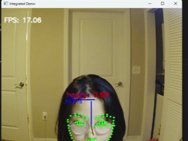

# Inattentiveness Detection System 🎯

This project implements a real-time multi-modal attentiveness monitoring system. It combines facial detection, head pose estimation, gaze estimation, and emotion recognition to **detect inattentiveness** in live video (e.g., webcam).

<video width="600" controls>
  <source src="media/rule4.mp4" type="video/mp4">
</video>

---

## 💡 Features

The system detects inattentiveness based on 4 rule-based conditions:

1. **No Face Detected** – The person leaves the camera view or occludes their face.


2. **Head Pose** – Head rotation exceeds what’s needed to view the screen.


3. **Emotion Distraction** – If the dominant emotion is not *neutral* with high confidence (>95%).


4. **Gaze Deviation** – Gaze not within calibrated screen bounds or saccade detected.


Then, over a 3-minute window, it computes how much of the time was inattentive:

| Inattentive Ratio | Status Label            |
|-------------------|-------------------------|
| > 25%             | Heavily Inattentive     |
| 15% – 25%         | Medium Inattentive      |
| 5% – 15%          | Slightly Inattentive    |
| ≤ 5%              | Mostly Attentive        |

---

## 🚀 Quick Start

### 1. Clone the Repository

```bash
git clone https://github.com/your-username/inattentiveness-detector.git
cd inattentiveness-detector
```

### 2. Set Up Python Environment (Optional)

```bash
python -m venv venv
source venv/bin/activate         # on Windows: venv\Scripts\activate
```

### 3. Install PyTorch (according to your CUDA version)

Check your CUDA version:
```bash
nvidia-smi
```

Then install PyTorch:  
[https://pytorch.org/get-started/locally/](https://pytorch.org/get-started/locally/)

Example:
```bash
pip install torch torchvision torchaudio --index-url https://download.pytorch.org/whl/cu118
```

### 4. Install Dependencies

```bash
pip install -r requirements.txt
```

---

## 🎥 Run the Demo

```bash
python run_demo_test.py
```

### Optional Arguments:
| Argument        | Default | Description |
|----------------|---------|-------------|
| `--input`      | 0       | Camera index or path to video |
| `--window`     | 180     | Sliding window in seconds |
| `--thresh1`    | 0.05    | Slight inattentiveness threshold |
| `--thresh2`    | 0.15    | Medium inattentiveness threshold |
| `--thresh3`    | 0.25    | Heavy inattentiveness threshold |
| `--dataset`    | wflw    | Landmark dataset for SPIGA |
| `--tracker`    | RetinaSort | Face tracker type |

---

## 🧠 Output Description

- `"INATTENTIVE"`: displayed in red when user is inattentive in current frame.
- `3-min Status`: printed based on last 3-minute analysis.
- Console also shows time ranges for inattentive segments like:

```
Inattentive segments:
From 14:53:10 to 14:53:23
From 14:54:01 to 14:54:17
```

---

## 📁 Directory Overview

```
run_demo_test.py         # Main script
gaze.py                  # Gaze estimation + calibration
models/best_model.pth    # Emotion recognition model (ResEmoteNet)
approach/                # ResEmoteNet implementation
spiga/                   # SPIGA face and landmark detection
assets/                  # Input video or test samples (optional)
```

---

## 📌 Notes

- Make sure `models/best_model.pth` exists and is compatible.
- You need a working webcam or valid video file to test.

---

## 📧 Contact

For questions, please reach out to Feiya Xiang or open an issue.